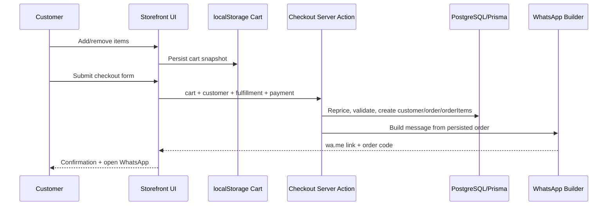

# Design: Almacén WhatsApp MVP

## Technical Approach

Greenfield MVP on Next.js App Router. Public catalog pages are server-rendered from PostgreSQL via Prisma; cart state stays client-side in `localStorage`; checkout submits validated guest data through a Server Action that persists the order and returns a WhatsApp deep link. Admin uses protected route handlers/server actions for CRUD and manual order progression. Mercado Pago is isolated behind a payment adapter so the initial flow stores a payment choice without calling external APIs.

## Architecture Decisions

| Decision | Options | Choice | Rationale |
|---|---|---|---|
| App structure | Single app vs separate storefront/admin apps | Single Next.js app with route groups `(storefront)` and `admin` | Lowest MVP overhead, shared UI/types, simple deployment |
| Order submission | API-only vs Server Actions first | Server Actions for forms, Route Handlers only for uploads/webhooks-ready edges | Fewer moving parts, keeps validation close to mutations |
| Cart persistence | DB cart vs cookie vs localStorage | `localStorage` guest cart + server price revalidation at checkout | No auth needed, resilient on mobile, avoids premature schema |
| Payment integration | Direct Mercado Pago now vs abstraction | `PaymentMethod` persisted + `PaymentProvider` interface stub | Keeps checkout stable while enabling later gateway integration |
| Images | External DAM vs direct object storage uploads | Admin upload to object storage via signed route; DB stores URL/alt | Simple, cheap, production-viable for MVP |

## Information Architecture / Route Map

**Storefront**: `/` home + promos; `/categoria/[slug]`; `/buscar?q=`; `/producto/[slug]`; `/carrito`; `/checkout`; `/pedido/[code]` confirmation.

**Admin**: `/admin` dashboard; `/admin/pedidos`; `/admin/pedidos/[id]`; `/admin/productos`; `/admin/promos`; `/admin/zonas`; `/admin/clientes` (read-only lookup).

Navigation is mobile-first: bottom cart CTA on storefront, simple sidebar/topbar in admin.

## Data Flow



Delivery/promo calculation runs server-side from active `Promotion` and `DeliveryZone` records. Client may show an estimate, but checkout recomputes authoritative totals before save.

## Domain Model

`Category 1-n Product`; `ProductImage 1-n Product`; `Promotion n-n Product/Category` (simple rule targets); `DeliveryZone 1-n Order`; `Customer 1-n Order`; `Order 1-n OrderItem`.

Core entities: `Product {name, slug, price, stockMode, isActive}`; `Promotion {type: percentage|fixed, scope, startsAt, endsAt, minSubtotal}`; `DeliveryZone {name, postalCodes?, fee, minOrder, isPickup}`; `Order {code, channel, status, fulfillmentType, paymentMethod, subtotal, discountTotal, deliveryFee, total, notes, whatsappUrl}`.

## Component / Module Boundaries

| Module | Responsibility |
|---|---|
| `app/(storefront)` | Catalog, cart, checkout, confirmation routes |
| `app/admin` | CRUD tables/forms and status actions |
| `components/storefront` / `components/admin` | UI composition using shadcn/ui |
| `lib/validators` | Zod schemas for products, promos, zones, checkout |
| `lib/pricing` | subtotal, promotion, delivery, total calculation |
| `lib/orders` | order creation orchestration + status transitions |
| `lib/whatsapp` | human-readable order message builder |
| `lib/payments` | provider interface + Mercado Pago placeholder adapter |
| `app/api/uploads` | signed upload contract / image metadata save |

## Interfaces / Contracts

```ts
type PaymentMethod = 'cash' | 'transfer' | 'mercado_pago_link';
type OrderStatus = 'draft' | 'placed' | 'confirmed' | 'preparing' | 'ready' | 'delivered' | 'cancelled';
interface PaymentProvider { createIntent(orderId: string): Promise<{reference: string}> }
```

Status workflow: `placed -> confirmed -> preparing -> ready -> delivered`, with `cancelled` allowed from any non-final active state. Admin actions must record `updatedAt` and optional internal note.

## File Changes

| File | Action | Description |
|---|---|---|
| `openspec/changes/almacen-whatsapp-mvp/design.md` | Create | Technical design artifact |
| `app/(storefront)/*` | Create | Catalog, cart, checkout, confirmation routes |
| `app/admin/*` | Create | Orders, products, promos, zones admin |
| `prisma/schema.prisma` | Create | Product/order/customer/promo/zone models |
| `prisma/seed.ts` | Create | Demo catalog, zones, promos, sample orders |
| `lib/{pricing,orders,validators,whatsapp,payments}/*` | Create | Core domain services and boundaries |

## Testing Strategy

| Layer | What to Test | Approach |
|---|---|---|
| Unit | pricing, WhatsApp formatting, status guards, Zod schemas | Add runner later; keep pure modules isolated now |
| Integration | checkout action creates repriced order correctly | Prisma test DB once infra exists |
| E2E | browse → cart → checkout → admin status update | Add Playwright later; not available yet |

## Migration / Rollout

Initial schema migration only. Seed demo data with realistic products, two delivery zones, one promo, and sample admin orders to accelerate validation.

## Open Questions

- [ ] How will admin authentication be enforced in MVP (basic auth, NextAuth, or reverse-proxy protection)?
- [ ] Which object storage provider will back signed image uploads?

## Tradeoffs / Non-Goals

Tradeoffs: localStorage cart sacrifices cross-device continuity; manual admin workflow avoids automation complexity; payment boundary adds one abstraction now to reduce later rewrite. Non-goals: customer accounts, live inventory sync, automatic WhatsApp sending, real Mercado Pago capture, courier tracking, and advanced promotion stacking.
